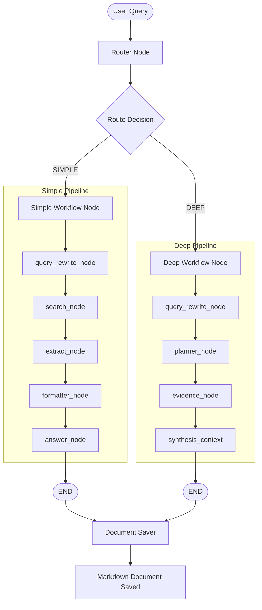

# Research Assistant Agent Architecture

This document details the system architecture, state management, and workflow routing of the AI-powered Research Assistant Agent.

---

## 1. System Overview

The Research Assistant Agent is a multi-workflow orchestrator built using **LangGraph**, **LangChain**, and **Google Gemini**. It dynamically routes queries between two dedicated execution paths based on query complexity:

1. **Simple Research**: Optimized for quick, single-topic factual lookups.
2. **Deep Research**: Optimized for comparative, analytical, and multi-source research tasks requiring structured reporting.

---

## 2. State Management (`ResearchState`)

The entire orchestration pipeline shares a central state. It is defined in [state.py](file:///d:/Agentic_AI/Research_Assisatant_Agent/app/graph/state.py) as a `TypedDict`:

| State Field | Type | Description |
| :--- | :--- | :--- |
| `query` | `str` | Original user input. |
| `route` | `str` | Classifier routing decision (`SIMPLE` or `DEEP`). |
| `rewritten_query`| `str` | Optimized version of the user query for web search. |
| `research_tasks` | `List[str]` | List of planned research sub-tasks (Deep Pipeline). |
| `search_results` | `List[SearchResult]`| Unprocessed search results returned by Tavily. |
| `extracted_contents`| `List[ExtractedContent]`| Full webpage text scraped from target URLs. |
| `evidence` | `List[Evidence]` | Structured facts collected per sub-task. |
| `synthesis_context`| `str` | Combined text context representing compiled evidence (Deep Pipeline). |
| `formatted_context`| `str` | Formatted source text block for final answering (Simple Pipeline). |
| `final_answer` | `str` | The final synthesized markdown response. |

---

## 3. Workflow Routing

Orchestrated by the top-level graph in [research_router.py](file:///d:/Agentic_AI/Research_Assisatant_Agent/app/graph/workflows/research_router.py):
- **Classifier Agent** ([classifier.py](file:///d:/Agentic_AI/Research_Assisatant_Agent/app/agents/classifier.py)): Analyzes input query using a zero-temperature LLM prompt and labels it either `SIMPLE` or `DEEP`.
- **Router Node** ([router_node.py](file:///d:/Agentic_AI/Research_Assisatant_Agent/app/graph/nodes/router_node.py)): Processes the label and routes execution to the chosen subgraph using `add_conditional_edges`.

---

## 4. Subgraph Workflows

### A. Simple Research Workflow
Designed for rapid factual lookup without task decomposition.
1. **Query Rewrite Node** ([query_rewrite_node.py](file:///d:/Agentic_AI/Research_Assisatant_Agent/app/graph/nodes/query_rewrite_node.py)):
   - Optimizes the raw input query into search-friendly terminology.
2. **Search Node** ([search_node.py](file:///d:/Agentic_AI/Research_Assisatant_Agent/app/graph/nodes/search_node.py)):
   - Executes a web search via the Tavily API, retrieving top URLs and summary snippets.
3. **Extract Node** ([extract_node.py](file:///d:/Agentic_AI/Research_Assisatant_Agent/app/graph/nodes/extract_node.py)):
   - Scrapes full textual content from target URLs using Tavily Extract.
4. **Formatter Node** ([formatter_node.py](file:///d:/Agentic_AI/Research_Assisatant_Agent/app/graph/nodes/formatter_node.py)):
   - Truncates extracted content to 4000 characters per page and builds a structured reference string.
5. **Answer Node** ([answer_node.py](file:///d:/Agentic_AI/Research_Assisatant_Agent/app/graph/nodes/answer_node.py)):
   - Generates the final detailed response using a Gemini-powered researcher template with in-text citations.

### B. Deep Research Workflow
Designed for complex analysis requiring division of labor and synthesis of viewpoints.
1. **Query Rewrite Node**:
   - Rewrites query for optimized web searches.
2. **Planner Node** ([planner_node.py](file:///d:/Agentic_AI/Research_Assisatant_Agent/app/graph/nodes/planner_node.py)):
   - Uses Gemini with structured output mapping to break the query into **2 focused research tasks**.
3. **Evidence Node** ([evidence_node.py](file:///d:/Agentic_AI/Research_Assisatant_Agent/app/graph/nodes/evidence_node.py)):
   - Iterates through the tasks, running web searches and compiling content blocks mapped to each task.
4. **Synthesis Context Node** ([synthesis_context.py](file:///d:/Agentic_AI/Research_Assisatant_Agent/app/graph/nodes/synthesis_context.py)):
   - Calls the synthesizer agent to compile evidence, analyze tradeoffs, compare viewpoints, resolve conflicts, and output a structured markdown report with citations.

---

## 5. Technical Stack

- **Core Framework**: Python `>=3.12`
- **Orchestration**: `langgraph` (v1.2.5) for cyclical state graph processing.
- **LLM Client**: `langchain-google-genai` (v4.2.5) to invoke Gemini models (defaulting to `gemini-2.5-flash`).
- **Data Gathering**: `tavily-python` (v0.7.24) for search & full-text extraction APIs.
- **CLI Framework**: `rich` (v15.0.0) for terminal banner display and status animations.
- **Environment Management**: `python-dotenv` for local API keys configuration.
