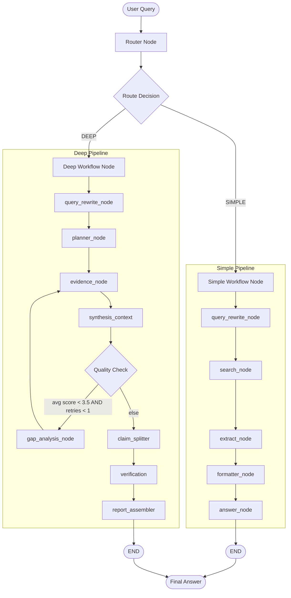

# Research Assistant Agent — Architecture

This document provides a comprehensive technical deep-dive into the system architecture, state management, workflow routing, node responsibilities, data models, and service layer of the AI-powered Research Assistant Agent.

---

## Table of Contents

1. [System Overview](#1-system-overview)
2. [State Management](#2-state-management)
3. [Workflow Routing](#3-workflow-routing)
4. [Simple Research Pipeline](#4-simple-research-pipeline)
5. [Deep Research Pipeline](#5-deep-research-pipeline)
6. [Quality Evaluation & Retry Loop](#6-quality-evaluation--retry-loop)
7. [Claim Verification Pipeline](#7-claim-verification-pipeline)
8. [Service Layer](#8-service-layer)
9. [Data Models](#9-data-models)
10. [External Tool Integration](#10-external-tool-integration)
11. [Frontend Architecture](#11-frontend-architecture)
12. [LLM Configuration](#12-llm-configuration)
13. [Data Flow Summary](#13-data-flow-summary)

---

## 1. System Overview

The Research Assistant Agent is a **multi-workflow orchestrator** built using **LangGraph**, **LangChain**, and **Google Gemini**. It dynamically routes queries between two dedicated execution paths based on query complexity, then optionally verifies every factual claim in the generated report against its original source material.



### Key Design Principles

| Principle | Implementation |
|:---|:---|
| **Separation of Concerns** | Each LangGraph node does exactly one thing. Business logic lives in `services/`, LLM prompts in `prompts/`, external API calls in `tools/` |
| **Shared State Machine** | All nodes read from and write to a single `ResearchState` TypedDict, enabling transparent data flow |
| **Conditional Routing** | LangGraph's `add_conditional_edges` enables dynamic branching (router split, quality retry loop) |
| **Structured LLM Output** | Pydantic models + `llm.with_structured_output()` enforce typed, parseable responses from Gemini |
| **Graceful Degradation** | Every LLM call and external API call has try/except fallbacks with sensible defaults |
| **Concurrent Execution** | Evidence gathering runs research sub-tasks in parallel via `ThreadPoolExecutor` |

---

## 2. State Management

The entire orchestration pipeline shares a central state defined as a `TypedDict` in [state.py](file:///d:/Agentic_AI/Research_Assisatant_Agent/app/graph/state.py). Every node receives the full state and returns a partial update dictionary that LangGraph merges back.

### `ResearchState` Fields

| State Field | Type | Written By | Read By | Description |
|:---|:---|:---|:---|:---|
| `query` | `str` | User input | All nodes | Original user query |
| `route` | `str` | `router_node` | `route_decision` | Routing decision: `"simple"` or `"deep"` |
| `rewritten_query` | `str` | `query_rewrite_node` | `planner_node`, `search_node`, `synthesis_context` | Search-optimized version of the query |
| `research_tasks` | `List[str]` | `planner_node`, `gap_analysis_node` | `evidence_node` | Planned research sub-tasks (Deep pipeline) |
| `search_results` | `List[SearchResult]` | `search_node` | `extract_node` | Raw Tavily search results with titles, snippets, URLs |
| `extracted_contents` | `List[ExtractedContent]` | `extract_node` | `formatter_node`, `verification_node` | Full webpage text scraped from URLs |
| `evidence` | `List[Evidence]` | `evidence_node` | `synthesis_context`, `verification_node` | Structured facts per research sub-task |
| `synthesis_context` | `str` | `synthesis_context` | `gap_analysis_node` | Compiled evidence text (Deep pipeline) |
| `formatted_context` | `str` | `formatter_node` | `answer_node` | Formatted source text block (Simple pipeline) |
| `final_answer` | `str` | `answer_node`, `synthesis_context` | `claim_splitter`, `report_assembler` | The synthesized markdown response |
| `confidence_scores` | `Dict[str, float]` | `synthesis_context` | `route_evaluation` | Self-evaluation scores (1.0–5.0 scale) |
| `retry_count` | `int` | `gap_analysis_node` | `route_evaluation` | Number of gap-fill iterations completed |
| `report_data` | `dict` | `synthesis_context` | — | Structured `ReportSchema` JSON (for programmatic access) |
| `claims` | `List[ClaimResult]` | `claim_splitter`, `verification_node` | `verification_node`, `report_assembler` | Extracted and verified factual claims |
| `verified_report` | `str` | `report_assembler` | Frontend / CLI output | Final report with inline verification badges |
| `overall_confidence` | `float` | `verification_node` | Frontend metrics | Mean confidence score across all verified claims |

### Supporting TypedDicts

```python
class SearchResult(TypedDict):       # Tavily search output
    title: str
    content: str                     # Snippet summary
    url: str

class ExtractedContent(TypedDict):   # Tavily extract output
    url: str
    raw_content: str                 # Full page text

class Evidence(TypedDict):           # Per-task evidence block
    task: str                        # The research sub-task
    source: str                      # Source URL
    content: str                     # Extracted content from that source
```

---

## 3. Workflow Routing

### Top-Level Graph

Defined in [research_router.py](file:///d:/Agentic_AI/Research_Assisatant_Agent/app/graph/workflows/research_router.py), the top-level graph contains three nodes:

```
Entry → router → (conditional) → simple | deep → END
```

### Router Node ([router_node.py](file:///d:/Agentic_AI/Research_Assisatant_Agent/app/graph/nodes/router_node.py))

The router node supports two modes:

1. **Manual Override**: If the incoming state already has `route` set to `"simple"` or `"deep"` (from the Streamlit sidebar's mode selector), it passes through unchanged.
2. **Auto-Classification**: Otherwise, it calls the [Classifier Service](file:///d:/Agentic_AI/Research_Assisatant_Agent/app/services/classifier.py) which uses a zero-temperature LLM prompt to label the query.

**Classification Criteria:**

| Route | Trigger Conditions |
|:---|:---|
| `SIMPLE` | Factual lookup, definition, short answer, single-topic query |
| `DEEP` | Comparison, analysis, multi-source research, report generation, trend analysis |

### Route Decision Function

The `route_decision()` function reads `state["route"]`, strips and lowercases it, and returns `"deep"` only for an exact match — everything else defaults to `"simple"`.

### Subgraph Invocation

The `simple_workflow_node()` and `deep_workflow_node()` functions invoke their respective compiled subgraphs as nested LangGraph executions, forwarding only the `query` field.

---

## 4. Simple Research Pipeline

**Purpose**: Rapid factual lookup without task decomposition.

**Defined in**: [simple_research.py](file:///d:/Agentic_AI/Research_Assisatant_Agent/app/graph/workflows/simple_research.py)

```
query_rewrite_node → search_node → extract_node → formatter_node → answer_node → END
```

### Node Details

#### 4.1 Query Rewrite Node ([query_rewrite_node.py](file:///d:/Agentic_AI/Research_Assisatant_Agent/app/graph/nodes/query_rewrite_node.py))

- **Service**: [query_rewriter.py](file:///d:/Agentic_AI/Research_Assisatant_Agent/app/services/query_rewriter.py)
- **Behavior**: Rewrites the raw user query into search-optimized terminology using a detailed prompt that handles 10 query categories:
  - Educational/Evergreen, Time-sensitive, Historical, Future, Location-sensitive, Comparisons, Ambiguous entities, Career/Exploratory, Keyword expansion
- **Key Feature**: Injects the current date (`datetime.now().strftime("%B %Y")`) to resolve relative time expressions ("latest", "current", "recent")
- **Intent Preservation**: The prompt explicitly forbids narrowing/broadening scope, inventing entities, or changing topics
- **Writes**: `rewritten_query`

#### 4.2 Search Node ([search_node.py](file:///d:/Agentic_AI/Research_Assisatant_Agent/app/graph/nodes/search_node.py))

- **Tool**: [tavily_search.py](file:///d:/Agentic_AI/Research_Assisatant_Agent/app/tools/tavily_search.py)
- **Behavior**: Calls `tavily_search(rewritten_query)` which executes a Tavily API search with up to 3 retries and 2-second backoff between attempts
- **Returns**: Top 5 results (configurable) with `title`, `content` (snippet), and `url`
- **Writes**: `search_results`

#### 4.3 Extract Node ([extract_node.py](file:///d:/Agentic_AI/Research_Assisatant_Agent/app/graph/nodes/extract_node.py))

- **Tool**: [tavily_search.py](file:///d:/Agentic_AI/Research_Assisatant_Agent/app/tools/tavily_search.py) → `tavily_extract()`
- **Behavior**: Collects all URLs from `search_results` and calls Tavily Extract API to scrape full-page textual content
- **Writes**: `extracted_contents` (list of `{url, raw_content}`)

#### 4.4 Formatter Node ([formatter_node.py](file:///d:/Agentic_AI/Research_Assisatant_Agent/app/graph/nodes/formatter_node.py))

- **Service**: [formatter.py](file:///d:/Agentic_AI/Research_Assisatant_Agent/app/services/formatter.py) → `format_extracted_content()`
- **Behavior**: Truncates each page's `raw_content` to **4,000 characters** and builds a numbered `SOURCE N` reference block with URL and content
- **Writes**: `formatted_context`

#### 4.5 Answer Node ([answer_node.py](file:///d:/Agentic_AI/Research_Assisatant_Agent/app/graph/nodes/answer_node.py))

- **Service**: [researcher.py](file:///d:/Agentic_AI/Research_Assisatant_Agent/app/services/researcher.py) → `generate_answer()`
- **Prompt**: [research_prompt.py](file:///d:/Agentic_AI/Research_Assisatant_Agent/app/prompts/research_prompt.py) — instructs the LLM to produce a detailed markdown answer using only provided sources, with in-text citations like `[1]`, `[2]`, and a `Sources` section
- **Writes**: `final_answer`

---

## 5. Deep Research Pipeline

**Purpose**: Complex analysis requiring task decomposition, multi-source synthesis, quality evaluation, and fact-checking.

**Defined in**: [deep_research.py](file:///d:/Agentic_AI/Research_Assisatant_Agent/app/graph/workflows/deep_research.py)

```
query_rewrite_node → planner_node → evidence_node → synthesis_context
    → (conditional) → gap_analysis_node → evidence_node   [retry loop]
                    → claim_splitter → verification → report_assembler → END
```

### Node Details

#### 5.1 Query Rewrite Node

Same as Simple Pipeline (see [Section 4.1](#41-query-rewrite-node-query_rewrite_nodepy)).

#### 5.2 Planner Node ([planner_node.py](file:///d:/Agentic_AI/Research_Assisatant_Agent/app/graph/nodes/planner_node.py))

- **Behavior**: Uses Gemini with structured output (`ResearchPlan` Pydantic model) to decompose the rewritten query into **2–5 focused research sub-tasks**
- **Structured Output Schema**:
  ```python
  class ResearchPlan(BaseModel):
      tasks: List[str]              # 2-5 focused sub-tasks
      task_count_rationale: str     # Why this many tasks were chosen
  ```
- **Dynamic Task Count**: The LLM analyzes query complexity and decides how many sub-tasks are needed (between 2 and 5), providing reasoning
- **Writes**: `research_tasks`

#### 5.3 Evidence Node ([evidence_node.py](file:///d:/Agentic_AI/Research_Assisatant_Agent/app/graph/nodes/evidence_node.py))

- **Behavior**: Iterates through `research_tasks`, running a web search per task via [researcher.py](file:///d:/Agentic_AI/Research_Assisatant_Agent/app/services/researcher.py) → `research_task()`, which calls Tavily search and structures results as `Evidence` blocks
- **Concurrency**: Uses `ThreadPoolExecutor` with `max_workers = len(tasks)` for parallel execution
- **Streamlit Compatibility**: Forwards `script_run_ctx` to worker threads via `add_script_run_ctx()` to prevent Streamlit context errors
- **Cumulative**: Appends new results to existing `evidence` list (important for retry rounds)
- **Error Handling**: Individual task failures return empty evidence blocks rather than crashing the pipeline
- **Writes**: `evidence`

#### 5.4 Synthesis Context Node ([synthesis_context.py](file:///d:/Agentic_AI/Research_Assisatant_Agent/app/graph/nodes/synthesis_context.py))

This node performs **two LLM calls**:

1. **Synthesis**: Calls [synthesizer.py](file:///d:/Agentic_AI/Research_Assisatant_Agent/app/services/synthesizer.py) → `synthesize_answer()` which formats all evidence into a TASK/SOURCE/CONTENT structure, then asks Gemini to analyze findings, compare viewpoints, highlight tradeoffs, use citations, and produce structured markdown.

2. **Self-Evaluation**: Uses a second LLM call with structured output (`ReportEvaluation`) to score the report on three dimensions:

   | Metric | Scale | What It Measures |
   |:---|:---|:---|
   | `source_coverage` | 1.0–5.0 | Are enough distinct sources and viewpoints represented? |
   | `claim_support` | 1.0–5.0 | Are all major claims backed by explicit citations? |
   | `completeness` | 1.0–5.0 | Does the report fully address all aspects of the query? |

3. **Report Parsing**: Calls [report_parser.py](file:///d:/Agentic_AI/Research_Assisatant_Agent/app/services/report_parser.py) to convert the markdown into a structured `ReportSchema` JSON via another LLM call.

- **Writes**: `synthesis_context`, `final_answer`, `confidence_scores`, `report_data`

---

## 6. Quality Evaluation & Retry Loop

After synthesis, a **conditional edge** in the deep pipeline evaluates report quality:

```python
def route_evaluation(state: ResearchState):
    scores = state.get("confidence_scores") or {}
    retry_count = state.get("retry_count", 0)

    avg_score = 0.0
    if scores:
        avg_score = sum(scores.values()) / len(scores)

    if avg_score < 3.5 and retry_count < 1:
        return "gap_analysis_node"    # Re-research
    else:
        return "claim_splitter"       # Proceed to verification
```

### Decision Logic

| Condition | Action |
|:---|:---|
| Average self-eval score **< 3.5** AND **0 retries** used | Route to `gap_analysis_node` for re-research |
| Average score **≥ 3.5** OR **1 retry** already used | Route to `claim_splitter` to proceed with verification |

### Gap Analysis Node ([gap_analysis_node.py](file:///d:/Agentic_AI/Research_Assisatant_Agent/app/graph/nodes/gap_analysis_node.py))

- **Behavior**: Receives the current report and original query, uses Gemini with structured output (`GapFillingPlan`) to identify what's missing and generate **exactly 2 new, targeted research queries** to fill the gaps
- **Safety**: Always enforces exactly 2 tasks (pads with generic queries if needed); handles LLM failures with fallback queries
- **Writes**: `research_tasks` (new list), `retry_count` (incremented by 1)
- **Next**: Loops back to `evidence_node` which re-runs searches and **appends** new evidence to the existing list

---

## 7. Claim Verification Pipeline

The Deep Research Pipeline includes a three-node fact-checking stage that verifies every claim in the generated report against its source material.

### 7.1 Claim Splitter Node ([claim_splitter_node.py](file:///d:/Agentic_AI/Research_Assisatant_Agent/app/graph/nodes/claim_splitter_node.py))

- **Behavior**: Takes `final_answer` and uses Gemini with structured output (`ClaimsList`) to extract **5–20 atomic, independently verifiable factual claims**
- **Claim Rules**:
  - One claim = one verifiable fact (number, name, date, causal statement)
  - Ignores transitional/summary sentences and opinion framing
  - Each claim under 30 words
  - Merges minor claims if there are too many
- **Writes**: `claims` (list of `ClaimResult` objects, initially with `status="unverified"`)

### 7.2 Verification Node ([verification_node.py](file:///d:/Agentic_AI/Research_Assisatant_Agent/app/graph/nodes/verification_node.py))

- **Agent**: [claim_verifier.py](file:///d:/Agentic_AI/Research_Assisatant_Agent/app/agents/claim_verifier.py)
- **Behavior**: For each claim, calls the `verify_claim()` async function which:
  1. Formats all `extracted_contents` + `evidence` into numbered passage blocks
  2. Asks Gemini to match the claim against passages and determine a verdict
  3. Returns a `ClaimVerifierOutput` with structured fields

- **Verification Statuses**:

  | Status | Meaning |
  |:---|:---|
  | `verified` | Source passages explicitly support the claim |
  | `weak` | Passages suggest it might be true but don't explicitly verify it |
  | `unverified` | No relevant information found in passages |
  | `conflicted` | Passages contain conflicting statements about the claim |

- **Concurrency Strategy**: Uses `asyncio.gather()` with staggered delays (3.5s between claims) to respect API rate limits. Runs in a separate thread via `run_async_synchronously()` to avoid Streamlit event loop conflicts.
- **Writes**: `claims` (updated with verification results), `overall_confidence` (mean of all claim confidence scores)

### 7.3 Report Assembler Node ([report_assembler_node.py](file:///d:/Agentic_AI/Research_Assisatant_Agent/app/graph/nodes/report_assembler_node.py))

- **Behavior**: Takes the `final_answer` markdown and injects inline HTML verification badges next to sentences that match verified claims
- **Matching Algorithm**:
  1. Splits each line of the report into sentences
  2. For each claim, uses `difflib.SequenceMatcher` to find the best-matching sentence (threshold: `ratio > 0.45`)
  3. Injects a styled HTML badge immediately after the matched sentence

- **Badge Types**:

  | Status | Badge | Style |
  |:---|:---|:---|
  | `verified` | `✓ source` (linked) | Green background (`#e8f5e9`), green text (`#2e7d32`) |
  | `weak` | `~ source` (linked) | Yellow background (`#fffde7`), amber text (`#f57f17`) |
  | `unverified` | `? unverified` | Red background (`#ffebee`), red text (`#c62828`) |
  | `conflicted` | `⚡ conflicted` | Orange background (`#fff3e0`), orange text (`#ef6c00`) |

- **Sources Section**: Appends a `## Sources` section at the end with numbered citations linking to source URLs and excerpts (up to 30 words)
- **Writes**: `verified_report`

---

## 8. Service Layer

The `app/services/` directory contains reusable business logic decoupled from the graph nodes:

| Service | File | Purpose |
|:---|:---|:---|
| **Classifier** | [classifier.py](file:///d:/Agentic_AI/Research_Assisatant_Agent/app/services/classifier.py) | Zero-temperature LLM prompt that returns `SIMPLE` or `DEEP` based on query characteristics |
| **Query Rewriter** | [query_rewriter.py](file:///d:/Agentic_AI/Research_Assisatant_Agent/app/services/query_rewriter.py) | Comprehensive 10-rule query optimization with date injection and intent preservation |
| **Researcher** | [researcher.py](file:///d:/Agentic_AI/Research_Assisatant_Agent/app/services/researcher.py) | `generate_answer()` for Simple pipeline; `research_task()` for per-task Tavily search + evidence structuring |
| **Synthesizer** | [synthesizer.py](file:///d:/Agentic_AI/Research_Assisatant_Agent/app/services/synthesizer.py) | Compiles all evidence into TASK/SOURCE/CONTENT blocks, then asks Gemini to analyze, compare, and produce structured markdown |
| **Formatter** | [formatter.py](file:///d:/Agentic_AI/Research_Assisatant_Agent/app/services/formatter.py) | `format_search_results()` and `format_extracted_content()` — truncates to 4,000 chars/page, builds numbered source blocks |
| **Document Saver** | [document_saver.py](file:///d:/Agentic_AI/Research_Assisatant_Agent/app/services/document_saver.py) | Persists research reports as timestamped markdown files with metadata headers to the `data/` directory |
| **Report Parser** | [report_parser.py](file:///d:/Agentic_AI/Research_Assisatant_Agent/app/services/report_parser.py) | Converts markdown reports into structured `ReportSchema` JSON via LLM, with safe fallback dictionary |

---

## 9. Data Models

Defined in `app/models/` using Pydantic for type safety and structured LLM outputs.

### ClaimResult ([claims.py](file:///d:/Agentic_AI/Research_Assisatant_Agent/app/models/claims.py))

```python
class ClaimResult(BaseModel):
    claim_text: str                                          # The factual claim
    status: Literal["verified", "weak", "unverified", "conflicted"]
    confidence: float                                        # 0.0 – 1.0
    source_url: Optional[str]                                # Best matching source URL
    source_passage: Optional[str]                            # Supporting excerpt (≤ 40 words)
    explanation: Optional[str]                               # One-sentence verdict reasoning
```

### ReportSchema ([report.py](file:///d:/Agentic_AI/Research_Assisatant_Agent/app/models/report.py))

```python
class Citation(BaseModel):
    url: str                    # Source URL
    title: str                  # Webpage title
    excerpt: str                # Factual snippet (≤ 30 words)

class ReportSection(BaseModel):
    heading: str                # Section header
    body: str                   # Markdown body content
    citations: List[Citation]   # Source citations for this section

class ReportSchema(BaseModel):
    title: str                              # Report title
    summary: str                            # 2-3 sentence executive summary
    sections: List[ReportSection]           # Report sections
    confidence: Optional[Dict[str, float]]  # Self-evaluation scores
    route_used: Literal["SIMPLE", "DEEP"]   # Which pipeline was used
    generated_at: datetime                  # Generation timestamp
```

---

## 10. External Tool Integration

### Tavily Search & Extract ([tavily_search.py](file:///d:/Agentic_AI/Research_Assisatant_Agent/app/tools/tavily_search.py))

| Function | API | Purpose | Config |
|:---|:---|:---|:---|
| `tavily_search()` | Tavily Search | Web search returning top results with titles, snippets, URLs | `max_results=5`, `search_depth="basic"`, 3 retries with 2s backoff |
| `tavily_extract()` | Tavily Extract | Full-page text scraping from a list of URLs | Single attempt, returns `{url, raw_content}` per page |

- **Client Management**: Lazy-initialized singleton `TavilyClient` with `TAVILY_API_KEY` validation
- **Error Handling**: Returns empty lists on failure rather than raising, so the pipeline degrades gracefully

---

## 11. Frontend Architecture

The Streamlit Web GUI is defined in [gui.py](file:///d:/Agentic_AI/Research_Assisatant_Agent/gui.py) with supporting modules in the `frontend/` directory.

### Layout

```
┌──────────────────────────────────────────────────────────────────┐
│  SIDEBAR                    │  CENTER (7/10)  │  RIGHT (3/10)   │
│                             │                 │                 │
│  ┌────────────────────────┐ │  Research Hub   │  📊 Metrics     │
│  │ RESEARCH AGENT         │ │  ─────────────  │  ─────────────  │
│  │ LangGraph + Gemini     │ │  [Search Box]   │  Sources: N     │
│  └────────────────────────┘ │  [🚀 Start]     │  Pages: N       │
│                             │  [🧹 Clear]     │  Time: Ns       │
│  🗂️ Research History       │                 │  Citations: N   │
│  ├─ Session 1 (date) 🗑️   │  Rewritten Query│                 │
│  ├─ Session 2 (date) 🗑️   │  Planner Tasks  │  ⚙️ Workflow    │
│  └─ Session 3 (date) 🗑️   │  Status Log     │  ─────────────  │
│                             │                 │  ✅ router      │
│  🛠️ Advanced Settings      │  ────────────── │  ✅ rewrite     │
│  ├─ Research Mode          │  📄 Export PDF   │  🔄 planner    │
│  ├─ Max Sources            │  📝 Export MD    │  ⏳ evidence    │
│  ├─ Search Depth           │  📋 Copy Report  │  ...            │
│  └─ Temperature            │                 │                 │
│                             │  🔍 Report      │  🔗 Sources     │
│  🕒 Timeline               │  📚 TOC         │  ─────────────  │
│  ├─ Event 1               │  [Markdown]     │  url1.com       │
│  └─ Event 2               │  🛡️ Fact-Check  │  url2.com       │
└──────────────────────────────────────────────────────────────────┘
```

### Frontend Modules

| Module | File | Purpose |
|:---|:---|:---|
| **Session State** | [state.py](file:///d:/Agentic_AI/Research_Assisatant_Agent/frontend/state.py) | Initializes Streamlit session state, loads/saves research history from `data/` directory |
| **Sidebar** | [sidebar.py](file:///d:/Agentic_AI/Research_Assisatant_Agent/frontend/components/sidebar.py) | Research history browser (load/delete), advanced settings (mode, sources, depth, temperature) |
| **Report View** | [report_view.py](file:///d:/Agentic_AI/Research_Assisatant_Agent/frontend/components/report_view.py) | Report rendering with TOC, PDF/MD export, clipboard copy, and claims verification table |
| **Workflow** | [workflow.py](file:///d:/Agentic_AI/Research_Assisatant_Agent/frontend/components/workflow.py) | Real-time node status tracker (pending → running → completed → skipped → failed) |
| **Timeline** | [timeline.py](file:///d:/Agentic_AI/Research_Assisatant_Agent/frontend/components/timeline.py) | Chronological event log of pipeline execution |
| **Metrics** | [metrics.py](file:///d:/Agentic_AI/Research_Assisatant_Agent/frontend/components/metrics.py) | Dashboard displaying sources, pages, elapsed time, citations, and research mode |
| **Sources** | [sources.py](file:///d:/Agentic_AI/Research_Assisatant_Agent/frontend/components/sources.py) | Lists all URLs discovered during research |
| **Styles** | [styles.py](file:///d:/Agentic_AI/Research_Assisatant_Agent/frontend/utils/styles.py) | Premium CSS injection for polished UI appearance |
| **Callbacks** | [callbacks.py](file:///d:/Agentic_AI/Research_Assisatant_Agent/frontend/utils/callbacks.py) | LangGraph callback handler that updates all UI placeholders in real-time as nodes execute |
| **PDF Generator** | [pdf_generator.py](file:///d:/Agentic_AI/Research_Assisatant_Agent/frontend/utils/pdf_generator.py) | Converts markdown report to downloadable PDF using ReportLab |

### Live UI Updates via Callbacks

The [StreamlitCallbackHandler](file:///d:/Agentic_AI/Research_Assisatant_Agent/frontend/utils/callbacks.py) implements LangGraph's callback interface to intercept node start/end events. When a node begins or completes:

1. Updates `workflow_steps` state (pending → running → completed)
2. Renders the updated workflow tracker
3. Appends events to the timeline
4. Updates metrics counters
5. Renders intermediate outputs (rewritten query, planner tasks)

---

## 12. LLM Configuration

### Shared Instance ([llm.py](file:///d:/Agentic_AI/Research_Assisatant_Agent/app/core/llm.py))

```python
llm = ChatGoogleGenerativeAI(
    model=CHAT_MODEL_NAME,    # Default: "gemini-2.5-flash"
    temperature=0             # Deterministic output for consistent behavior
)
```

### Settings ([settings.py](file:///d:/Agentic_AI/Research_Assisatant_Agent/app/core/settings.py))

| Setting | Environment Variable | Default | Purpose |
|:---|:---|:---|:---|
| `CHAT_MODEL_NAME` | `CHAT_MODEL_NAME` | `gemini-2.5-flash` | Which Gemini model to use |
| `MD_FILE_STORE_LOCATION` | `DOCUMENT_STORE_PATH` | `data` | Directory for saved research reports |

### LLM Usage Patterns Across Nodes

| Pattern | Used By | Purpose |
|:---|:---|:---|
| `llm \| StrOutputParser()` | Classifier, Query Rewriter, Synthesizer, Researcher | Free-text string responses |
| `llm.with_structured_output(Model)` | Planner, Gap Analysis, Claim Splitter, Claim Verifier, Synthesis Evaluator, Report Parser | Type-safe Pydantic model responses |
| `structured_llm.ainvoke()` | Claim Verifier | Async invocation for concurrent verification |

---

## 13. Data Flow Summary

### Simple Pipeline — Complete Data Flow

```
User Query: "What is RAG?"
    │
    ▼
[query_rewrite_node]
    │  Reads: query
    │  Writes: rewritten_query = "Retrieval-Augmented Generation RAG explanation architecture"
    ▼
[search_node]
    │  Reads: rewritten_query
    │  Writes: search_results = [{title, content, url}, ...]  (5 results)
    ▼
[extract_node]
    │  Reads: search_results → urls
    │  Writes: extracted_contents = [{url, raw_content}, ...]
    ▼
[formatter_node]
    │  Reads: extracted_contents
    │  Writes: formatted_context = "SOURCE 1\nURL: ...\nCONTENT: ...(4000 chars)..."
    ▼
[answer_node]
    │  Reads: rewritten_query, formatted_context
    │  Writes: final_answer = "# Retrieval-Augmented Generation\n..."
    ▼
    Output: final_answer (markdown with citations)
```

### Deep Pipeline — Complete Data Flow

```
User Query: "Compare GPT vs BERT vs T5"
    │
    ▼
[query_rewrite_node]
    │  Writes: rewritten_query
    ▼
[planner_node]
    │  Reads: rewritten_query
    │  Writes: research_tasks = ["GPT architecture strengths...", "BERT bidirectional...", "T5 text-to-text..."]
    ▼
[evidence_node]  ← ThreadPoolExecutor (parallel)
    │  Reads: research_tasks
    │  Writes: evidence = [{task, source, content}, ...]  (per task × per search result)
    ▼
[synthesis_context]
    │  Reads: rewritten_query, evidence
    │  Writes: synthesis_context, final_answer, confidence_scores, report_data
    ▼
[route_evaluation]  ← Conditional Edge
    │  Reads: confidence_scores (avg), retry_count
    │
    ├── avg < 3.5 AND retries < 1 ──→ [gap_analysis_node]
    │                                      │  Writes: research_tasks (new), retry_count += 1
    │                                      └──→ [evidence_node] (loop back, appends evidence)
    │                                              └──→ [synthesis_context] (re-synthesize)
    │
    └── else ──→ [claim_splitter]
                    │  Reads: final_answer
                    │  Writes: claims = [ClaimResult(...), ...]  (5-20 claims)
                    ▼
                 [verification]
                    │  Reads: claims, extracted_contents, evidence
                    │  Writes: claims (updated statuses), overall_confidence
                    ▼
                 [report_assembler]
                    │  Reads: final_answer, claims
                    │  Writes: verified_report (markdown with inline badges + Sources section)
                    ▼
                    Output: verified_report
```

---

## Technical Stack Summary

| Layer | Technology | Version | Role |
|:---|:---|:---|:---|
| **Runtime** | Python | ≥ 3.12 | Core language |
| **Orchestration** | LangGraph | 1.2.5 | State graph engine with conditional edges, subgraphs, and compiled workflows |
| **LLM Framework** | LangChain Core | 1.4.7 | Output parsers, runnable configs, callback system |
| **LLM Client** | langchain-google-genai | 4.2.5 | Google Gemini integration (`ChatGoogleGenerativeAI`) |
| **Data Validation** | Pydantic | 2.13.4 | Structured LLM outputs, data models, field validation |
| **Web Search** | Tavily Python | 0.7.24 | Search API and full-text webpage extraction |
| **Web GUI** | Streamlit | ≥ 1.35.0 | Interactive research dashboard |
| **CLI** | Rich | 15.0.0 | Terminal UI with panels, markdown, spinners |
| **PDF Export** | ReportLab | ≥ 4.1.0 | Markdown-to-PDF conversion |
| **Config** | python-dotenv | 1.2.2 | `.env` file loading for API keys |
